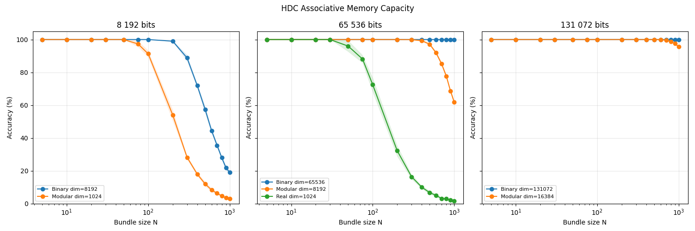

# Hypervector - Associative Memory

Benchmark retrieval accuracy vs. bundle size across HDV types and dimensions.
HDV types are compared at equal total bit-width to give a fair capacity comparison.

## Run
```
cargo run --release --example kv_store > kv_results.csv
python py/plot_kv.py          # pip install pandas matplotlib
```




